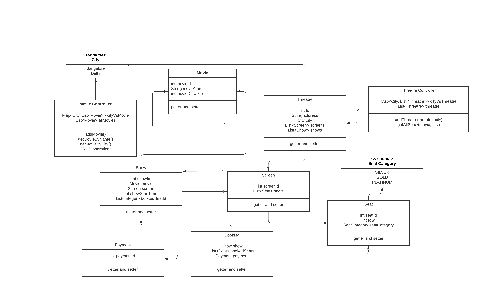

# Book My Show

### Objects
1. User
2. Movie
3. City
4. Theatre
5. Screen
6. Shows
7. Seats
8. Booking
9. Payment

### [UML Diagram](https://lucid.app/publicSegments/view/5f009422-5631-4c94-b55f-7806d730fbb1/image.png)

### How to manage Concurrency control on seat booking
